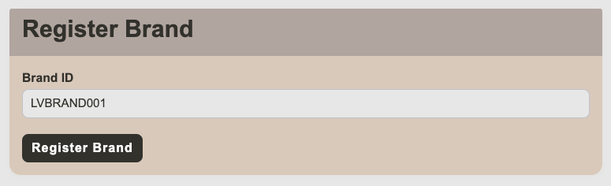
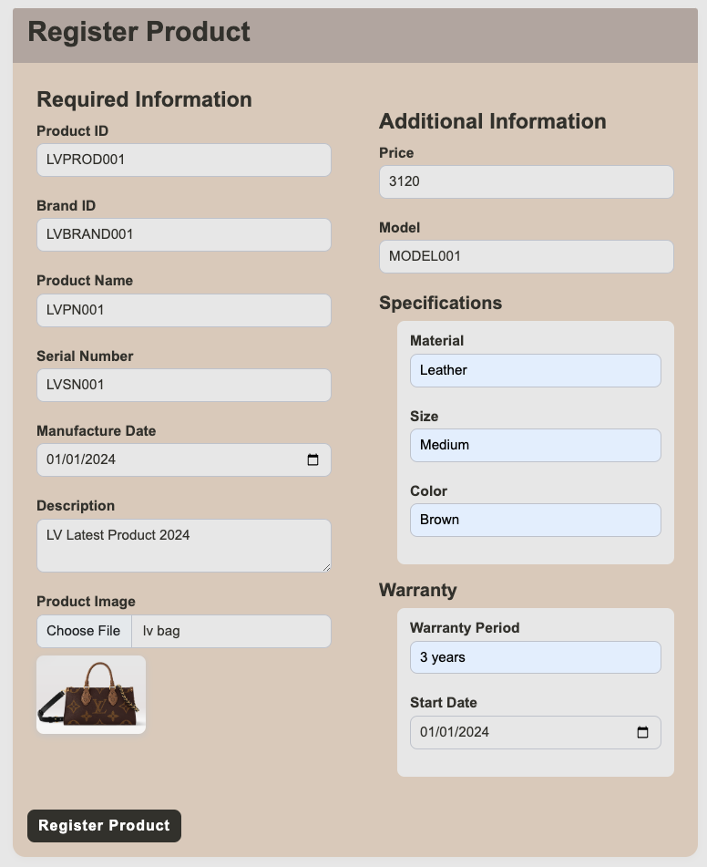
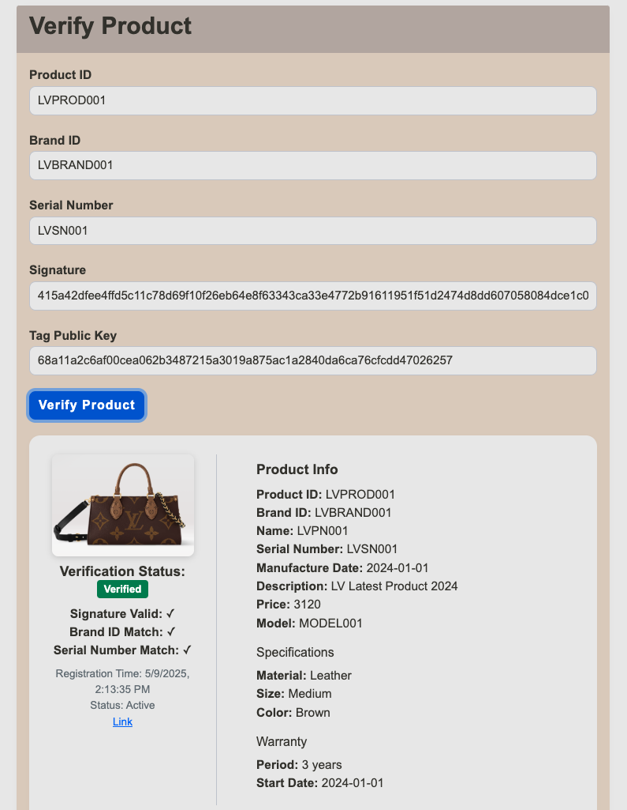

# Blockchain-Based Supply Chain Authentication for Luxury and Collectible Goods

## Overview
This project implements a blockchain-based authentication system for luxury and collectible goods, addressing the global counterfeit market problem estimated at over $1.7 trillion annually. The system combines blockchain technology, IPFS storage, and Ed25519 digital signatures to provide a secure and verifiable authentication solution.

## Key Features
- **Blockchain Integration**: Uses Cardona zkEVM for secure and efficient transaction processing
- **IPFS Storage**: Decentralized storage for product information
- **Ed25519 Digital Signatures**: Secure authentication mechanism
- **NFC Tag Integration**: Physical product authentication
- **Smart Contract Verification**: Tamper-proof product registration and verification

## Demo & UI Screenshots

### Demo Video
[[Demo Video]](assets/Demo.MOV)
> Click to watch the demo (Demo.MOV)

### UI Screenshots

#### Brand Creation UI


#### Brand Registration UI


#### Product Validation UI


## Problem Statement
The global counterfeit market poses significant challenges for luxury goods authentication:
- Traditional paper certifications can be forged
- Laser labels and NFC chips can be counterfeited
- Customers lack reliable means to verify product authenticity
- Current systems rely heavily on human experts

## Solution
Our system provides:
1. **Secure Product Registration**:
   - Products registered on blockchain with unique identifiers
   - Production and sales history stored on IPFS
   - Ed25519 digital signatures for authentication

2. **Customer Verification**:
   - NFC tag scanning for product information
   - Digital signature verification
   - Blockchain-based authenticity confirmation

## Technical Stack
- **Blockchain**: Cardona zkEVM
- **Storage**: IPFS (via Pinata)
- **Cryptography**: Ed25519 digital signatures
- **Smart Contracts**: Solidity
- **Frontend**: React.js
- **Backend**: Node.js

## Installation

### Prerequisites
- Node.js (v16 or higher)
- npm or yarn
- Git

### Setup
1. Clone the repository:
```bash
git clone https://github.com/HsuanChi1204/blockchainProject.git
cd blockchainProject
```

2. Install dependencies:
```bash
npm install
```

3. Set up environment variables:
```bash
cp .env.example .env
```
Fill in the following fields in `.env`:
- `PRIVATE_KEY` — Your Metamask private key (for contract interaction)
- `PINATA_API_KEY` — Your Pinata API key (for IPFS upload)
- `PINATA_API_SECRET` — Your Pinata API secret
- `CARDONA_RPC_URL` — Cardona zkEVM RPC URL (e.g. https://rpc.cardona.zkevm-rpc.com)

4. Start the server:
```bash
node src/server/index.js
```

5. Open the frontend:
- Open `src/client/index.html` in your browser (or deploy with a static server)

## Usage

### Product Registration
1. Register a brand:
```bash
npx hardhat run scripts/product-test.js --network cardona
```

2. Register a product:
```bash
npx hardhat run scripts/product-test.js --network cardona
```

### Verification
1. Scan NFC tag
2. Verify digital signature
3. Check blockchain record
4. Confirm product authenticity

## Project Structure
```
blockchainProject/
├── contracts/           # Smart contracts
├── scripts/            # Deployment and test scripts
├── src/               # Source code
│   ├── crypto/        # Cryptographic functions
│   ├── ipfs/          # IPFS integration
│   └── nfc/           # NFC tag handling
├── test/              # Test files
└── docs/             # Documentation
```

## Testing
Run the test suite:
```bash
npx hardhat test
```

## Contributing
1. Fork the repository
2. Create your feature branch (`git checkout -b feature/AmazingFeature`)
3. Commit your changes (`git commit -m 'Add some AmazingFeature'`)
4. Push to the branch (`git push origin feature/AmazingFeature`)
5. Open a Pull Request

## License
This project is licensed under the MIT License - see the LICENSE file for details.

## Authors
- Hsuan-Chi Chang (hsuanchi@vt.edu)
- Wei-Ju Li (weijuli@vt.edu)

## Acknowledgments
- Virginia Tech
- Cardona zkEVM team
- Pinata for IPFS services

## References
[1] Global Counterfeit Market Statistics, 2025

